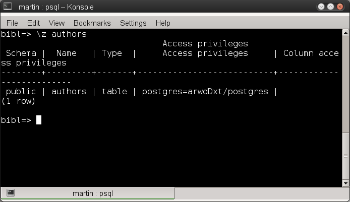
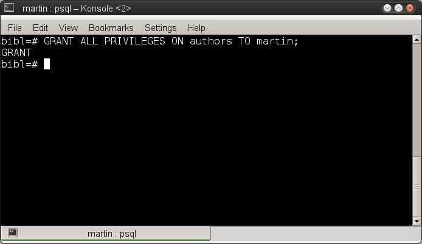
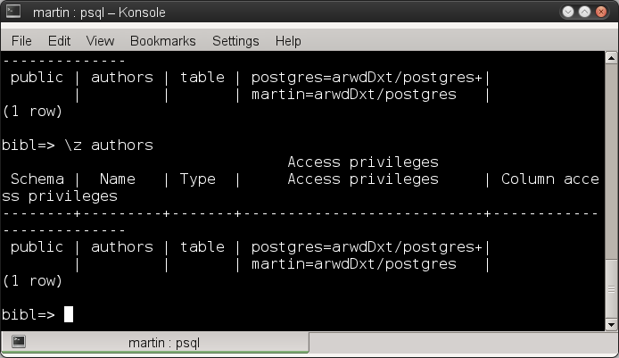
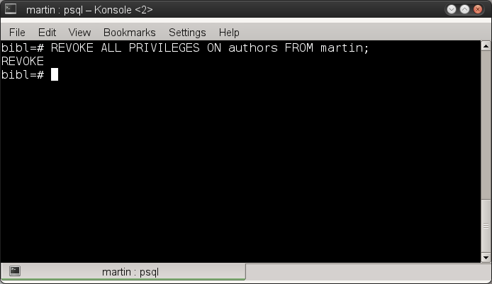
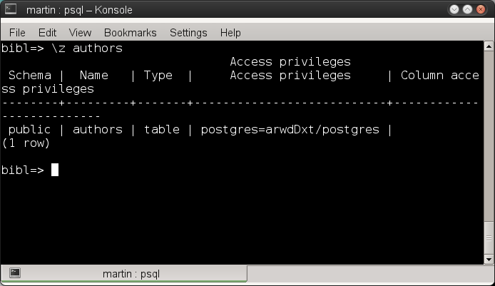
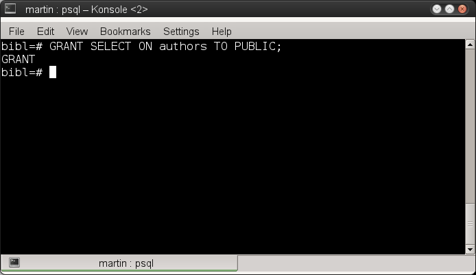
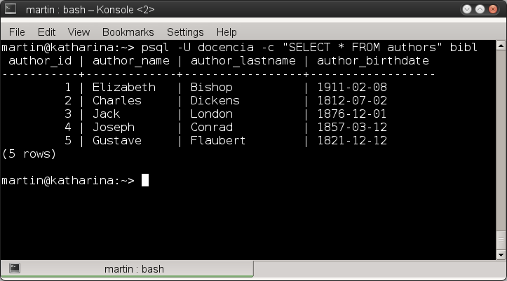
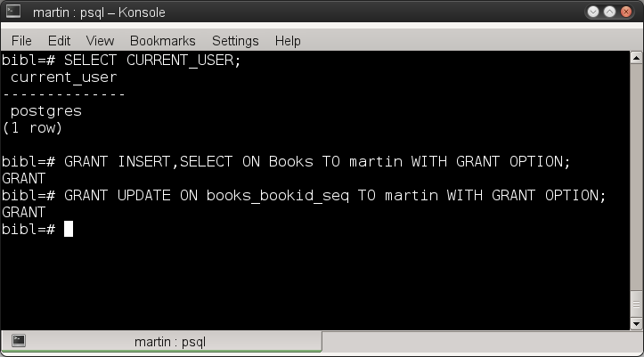
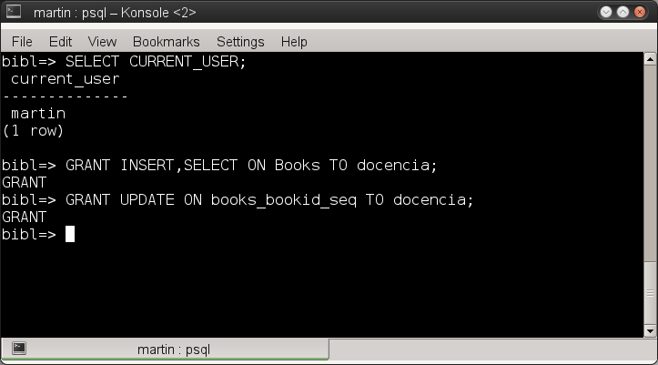
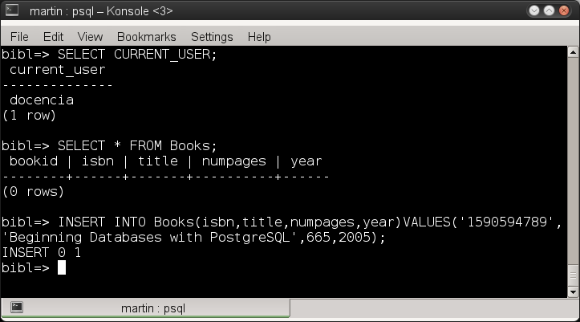

# Utilizando los comandos GRANT y REVOKE en PostgreSQL - Parte II

<ul>
<li><b>ALL PRIVILEGES:</b> Otorga todos los privilegios al usuario sobre un particular objeto.</li>
<li><b>PUBLIC:</b> En vez de asignar los privilegios a cada usuario (uno por uno) , se utiliza esta palabra para asignar los privilegios a cada uno de los usuarios autentificados en la base de datos, incluso a aquellos que no han sido creados.</li>
</ul>

Además para el comando GRANT tenemos la opción de:

<ul>
<li>WITH GRANT OPTION Cuando se crea un objeto en la base de datos, el creador de ese objeto es el único que puede otorgar privilegios al objeto para que otros usuarios lo utilicen, con esta opción el propietario del objeto permite que otros usuarios puedan asignar privilegios a un objeto de sus propiedad.</li>
</ul>

Mostraré unos ejemplos:

<b>ALL PRIVILEGES</b>

Primero el uso de <b>GRANT</b> con la opción <b>ALL PRIVILEGES</b>.

Mostramos los privilegios del usuario martin en la tabla authors con el comando \z authors

Ahora con el usuario postgres (propietario del objeto) le asignamos todos los privilegios al usuario martin. con el siguiente comando:

<pre>
 GRANT ALL PRIVILEGES ON authors TO martin;
 </pre>
 

Vuelvo a mostrar todos los privilegios del usuario <b>martin</b> y compruebo que todos los permisos le han sido otorgados.

Para retirar todos los privilegios ejecuto como el usuario postgres el siguiente comando:

<pre>
REVOKE ALL PRIVILEGES ON authors FROM martin;
</pre>

Muestro nuevamente los privilegios de la tabla y compruebo que el usuario <b>martin</b> no tiene ningún privilegio asignado.

<h3>PUBLIC</h3>

Ahora con el usuario postgres ejecuto el siguiente comando

<pre>
GRANT SELECT ON authors TO PUBLIC;
</pre>

El cual otorga el privilegio SELECT a todos los usuarios incluso a aquellos que no se han creado dentro de la DBMS.

<pre>
GRANT SELECT ON authors TO PUBLIC;
</pre>

Para comprobar este privilegio ejecuto una consulta SELECT con un usuario llamado docencia, quien no necesito que se le otorgaran privilegios de manera especifica.

<h3>WITH GRANT OPTION</H3>

Únicamente el creador del objeto puede usar el comando GRANT para otorgar privilegios a otros usuarios, sin embargo con la opción WITH GRANT OPTION del comando GRANT puede delegarle la capacidad de otorgarle privilegios sobre su objeto a otros usuarios.

Para este ejemplo utilizaremos el script para crear una tabla <i>Books</i>.

Ahora bien, el usuario postgres requiere que el usuario martin tenga los privilegios de SELECT e INSERT, pero que también martin tenga la capacidad de otorgarlos a otros usuarios, ejecutamos los siguientes comandos:

<pre>
GRANT INSERT, SELECT ON Books TO martin WITH GRANT OPTION;
GRANT UPDATE ON books_bookid_seq TO martin WITH GRANT OPTION;
</pre>

Ahora martin tiene la capacidad de poder otorgarle los privilegios a docencia en la tabla y en la secuencia.

<pre>
GRANT INSERT,SELECT ON Books TO docencia;
</pre>
<pre>
GRANT UPDATE ON books_bookid_seq TO docencia;
</pre>

Para que este usuario pueda ahora ejecutar la consulta y la creación de nuevos registros en la tabla.

